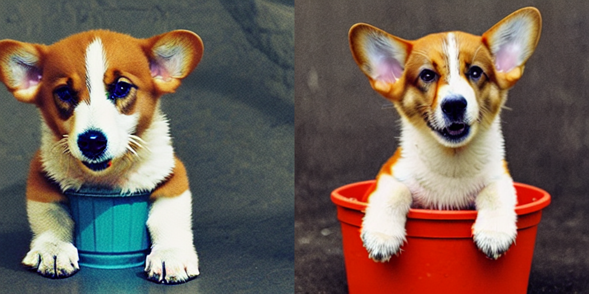
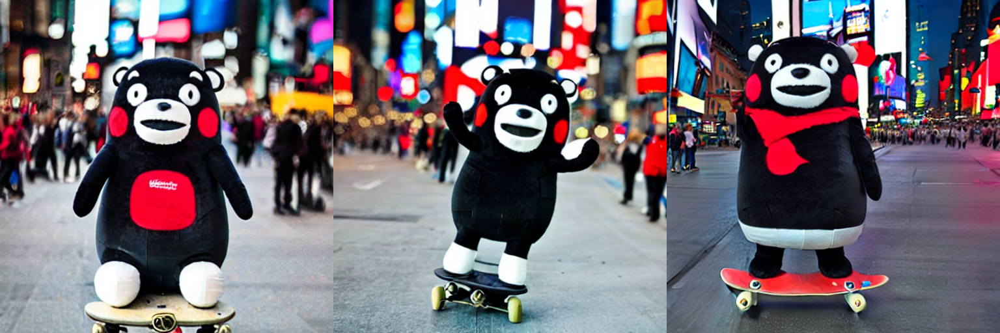
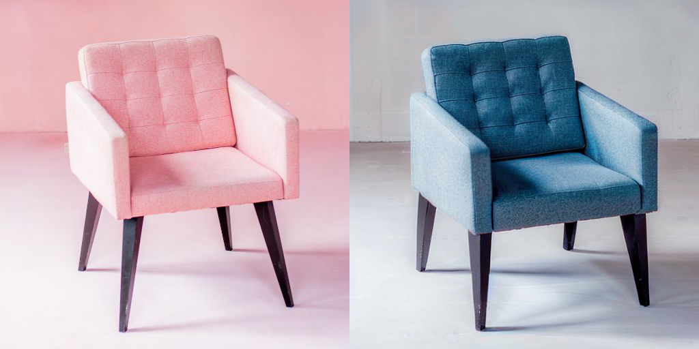
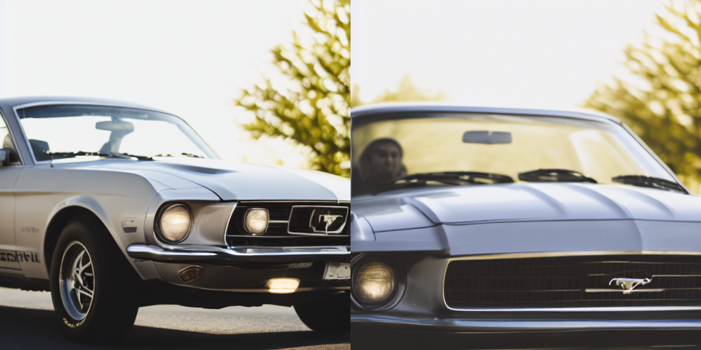
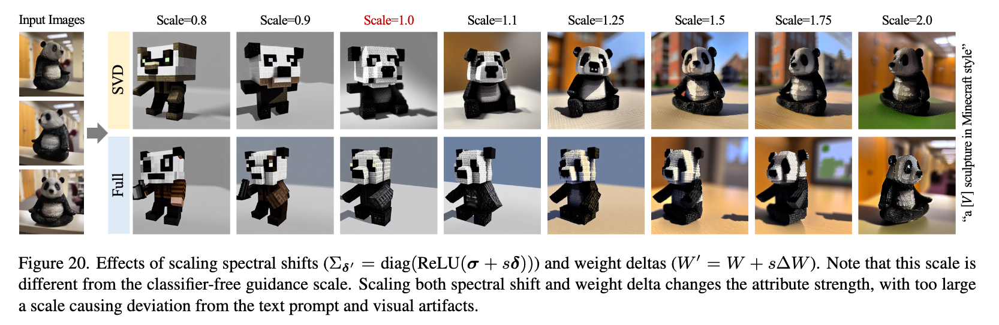
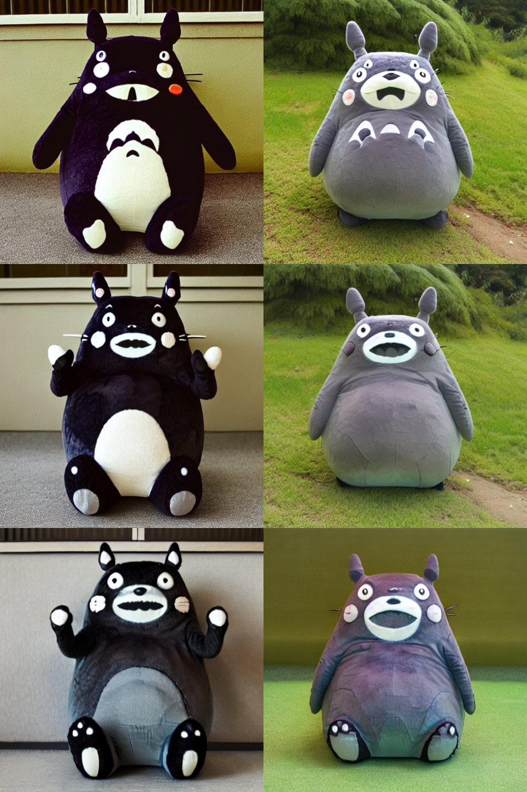

# SVDiff-pytorch
<a href="https://colab.research.google.com/github/mkshing/svdiff-pytorch/blob/main/scripts/svdiff_pytorch.ipynb" target="_parent"></a> 
[](https://huggingface.co/spaces/svdiff-library/SVDiff-Training-UI)


An implementation of [SVDiff: Compact Parameter Space for Diffusion Fine-Tuning](https://arxiv.org/abs/2303.11305) by using d🧨ffusers. 

My summary tweet is found [here](https://twitter.com/mk1stats/status/1642865505106272257).



left: LoRA, right: SVDiff


Compared with LoRA, the number of trainable parameters is 0.5 M less parameters and the file size is only 1.2MB (LoRA: 3.1MB)!!



## Updates
### 2023.4.11
- Released v0.2.0 (please see [here](https://github.com/mkshing/svdiff-pytorch/releases/tag/v0.2.0) for the details). By this change, you get better results with less training steps than the first release v0.1.1!!
- Add [Single Image Editing](#single-image-editing)
  <br>
  
  <br>"photo of a ~~pink~~ **blue** chair with black legs" (without DDIM Inversion) 


## Installation 
```
$ pip install svdiff-pytorch
```
Or, manually 
```bash
$ git clone https://github.com/mkshing/svdiff-pytorch
$ pip install -r requirements.txt
```

## Single-Subject Generation
"Single-Subject Generation" is a domain-tuning on a single object or concept (using 3-5 images). (See Section 4.1)

### Training
According to the paper, the learning rate for SVDiff needs to be 1000 times larger than the lr used for fine-tuning. 

```bash
export MODEL_NAME="runwayml/stable-diffusion-v1-5"
export INSTANCE_DIR="path-to-instance-images"
export CLASS_DIR="path-to-class-images"
export OUTPUT_DIR="path-to-save-model"

accelerate launch train_svdiff.py \
  --pretrained_model_name_or_path=$MODEL_NAME  \
  --instance_data_dir=$INSTANCE_DIR \
  --class_data_dir=$CLASS_DIR \
  --output_dir=$OUTPUT_DIR \
  --with_prior_preservation --prior_loss_weight=1.0 \
  --instance_prompt="photo of a sks dog" \
  --class_prompt="photo of a dog" \
  --resolution=512 \
  --train_batch_size=1 \
  --gradient_accumulation_steps=1 \
  --learning_rate=1e-3 \
  --learning_rate_1d=1e-6 \
  --train_text_encoder \
  --lr_scheduler="constant" \
  --lr_warmup_steps=0 \
  --num_class_images=200 \
  --max_train_steps=500
```

### Inference

```python
from diffusers import DiffusionPipeline, DPMSolverMultistepScheduler
import torch

from svdiff_pytorch import load_unet_for_svdiff, load_text_encoder_for_svdiff

pretrained_model_name_or_path = "runwayml/stable-diffusion-v1-5"
spectral_shifts_ckpt_dir = "ckpt-dir-path"
unet = load_unet_for_svdiff(pretrained_model_name_or_path, spectral_shifts_ckpt=spectral_shifts_ckpt_dir, subfolder="unet")
text_encoder = load_text_encoder_for_svdiff(pretrained_model_name_or_path, spectral_shifts_ckpt=spectral_shifts_ckpt_dir, subfolder="text_encoder")
# load pipe
pipe = StableDiffusionPipeline.from_pretrained(
    pretrained_model_name_or_path,
    unet=unet,
    text_encoder=text_encoder,
)
pipe.scheduler = DPMSolverMultistepScheduler.from_config(pipe.scheduler.config)
pipe.to("cuda")
image = pipe("A picture of a sks dog in a bucket", num_inference_steps=25).images[0]
```

You can use the following CLI too! Once it's done, you will see `grid.png` for the result.

```bash
python inference.py \
  --pretrained_model_name_or_path="runwayml/stable-diffusion-v1-5"  \
  --spectral_shifts_ckpt="ckpt-dir-path"  \
  --prompt="A picture of a sks dog in a bucket"  \
  --scheduler_type="dpm_solver++"  \
  --num_inference_steps=25  \
  --num_images_per_prompt=2 
```

## Single Image Editing
### Training
In Single Image Editing, your instance prompt should be just the description of your input image **without the identifier**. 

```bash
export MODEL_NAME="runwayml/stable-diffusion-v1-5"
export INSTANCE_DIR="dir-path-to-input-image"
export CLASS_DIR="path-to-class-images"
export OUTPUT_DIR="path-to-save-model"

accelerate launch train_svdiff.py \
  --pretrained_model_name_or_path=$MODEL_NAME  \
  --instance_data_dir=$INSTANCE_DIR \
  --class_data_dir=$CLASS_DIR \
  --output_dir=$OUTPUT_DIR \
  --instance_prompt="photo of a pink chair with black legs" \
  --resolution=512 \
  --train_batch_size=1 \
  --gradient_accumulation_steps=1 \
  --learning_rate=1e-3 \
  --learning_rate_1d=1e-6 \
  --train_text_encoder \
  --lr_scheduler="constant" \
  --lr_warmup_steps=0 \
  --max_train_steps=500
```

### Inference

```python
import torch
from PIL import Image
from diffusers import DDIMScheduler
from svdiff_pytorch import load_unet_for_svdiff, load_text_encoder_for_svdiff, StableDiffusionPipelineWithDDIMInversion

pretrained_model_name_or_path = "runwayml/stable-diffusion-v1-5"
spectral_shifts_ckpt_dir = "ckpt-dir-path"
image = "path-to-image"
source_prompt = "prompt-for-image"
target_prompt = "prompt-you-want-to-generate"

unet = load_unet_for_svdiff(pretrained_model_name_or_path, spectral_shifts_ckpt=spectral_shifts_ckpt_dir, subfolder="unet")
text_encoder = load_text_encoder_for_svdiff(pretrained_model_name_or_path, spectral_shifts_ckpt=spectral_shifts_ckpt_dir, subfolder="text_encoder")
# load pipe
pipe = StableDiffusionPipelineWithDDIMInversion.from_pretrained(
    pretrained_model_name_or_path,
    unet=unet,
    text_encoder=text_encoder,
)
pipe.scheduler = DDIMScheduler.from_config(pipe.scheduler.config)
pipe.to("cuda")

# (optional) ddim inversion
# if you don't do it, inv_latents = None
image = Image.open(image).convert("RGB").resize((512, 512))
# in SVDiff, they use guidance scale=1 in ddim inversion
# They use target_prompt in DDIM inversion for better results. See below for comparison between source_prompt and target_prompt.
inv_latents = pipe.invert(target_prompt, image=image, guidance_scale=1.0).latents

# They use a small cfg scale in Single Image Editing 
image = pipe(target_prompt, latents=inv_latents, guidance_scale=3, eta=0.5).images[0]
```

DDIM inversion with target prompt (left) v.s. source prompt (right):
<br>

<br>"photo of a grey ~~Beetle~~ **Mustang** car" (original image: https://unsplash.com/photos/YEPDV3T8Vi8)

To use slerp to add more stochasticity,
```python
from svdiff_pytorch.utils import slerp_tensor

# prev steps omitted
inv_latents = pipe.invert(target_prompt, image=image, guidance_scale=1.0).latents
noise_latents = pipe.prepare_latents(inv_latents.shape[0], inv_latents.shape[1], 512, 512, dtype=inv_latents.dtype, device=pipe.device, generator=torch.Generator("cuda").manual_seed(0))
inv_latents =  slerp_tensor(0.5, inv_latents, noise_latents)
image = pipe(target_prompt, latents=inv_latents).images[0]
```


## Gradio
You can also try SVDiff-pytorch in a UI with [gradio](https://gradio.app/). This demo supports both training and inference!

[](https://huggingface.co/spaces/svdiff-library/SVDiff-Training-UI)

If you want to run it locally, run the following commands step by step.
```bash
$ git clone --recursive https://github.com/mkshing/svdiff-pytorch.git
$ cd scripts/gradio
$ pip install -r requirements.txt 
$ export HF_TOKEN="YOUR_HF_TOKEN_HERE"
$ python app.py
```

## Additional Features

### Spectral Shift Scaling



You can adjust the strength of the weights by `--spectral_shifts_scale`

Here's a result for 0.8, 1.0, 1.2 (1.0 is the default).



### Fast prior generation by using ToMe
By using [ToMe for SD](https://github.com/dbolya/tomesd), the prior generation can be faster! 
```
$ pip install tomesd
```
And, add `--enable_tome_merging` to your training arguments!

## Citation

```bibtex
@misc{https://doi.org/10.48550/arXiv.2303.11305,
      title         = {SVDiff: Compact Parameter Space for Diffusion Fine-Tuning}, 
      author        = {Ligong Han and Yinxiao Li and Han Zhang and Peyman Milanfar and Dimitris Metaxas and Feng Yang},
      year          = {2023},
      eprint        = {2303.11305},
      archivePrefix = {arXiv},
      primaryClass  = {cs.CV},
      url           = {https://arxiv.org/abs/2303.11305}
}
```

```bibtex
@misc{hu2021lora,
      title         = {LoRA: Low-Rank Adaptation of Large Language Models},
      author        = {Hu, Edward and Shen, Yelong and Wallis, Phil and Allen-Zhu, Zeyuan and Li, Yuanzhi and Wang, Lu and Chen, Weizhu},
      year          = {2021},
      eprint        = {2106.09685},
      archivePrefix = {arXiv},
      primaryClass  = {cs.CL}
}
```

```bibtex
@article{bolya2023tomesd,
      title   = {Token Merging for Fast Stable Diffusion},
      author  = {Bolya, Daniel and Hoffman, Judy},
      journal = {arXiv},
      url     = {https://arxiv.org/abs/2303.17604},
      year    = {2023}
}
```

## Reference
- [DreamBooth in diffusers](https://github.com/huggingface/diffusers/tree/main/examples/dreambooth)
- [DreamBooth in ShivamShrirao](https://github.com/ShivamShrirao/diffusers/tree/main/examples/dreambooth)
- [Data from custom-diffusion](https://github.com/adobe-research/custom-diffusion#getting-started) 

## TODO
- [x] Training
- [x] Inference
- [x] Scaling spectral shifts
- [x] Support Single Image Editing
- [ ] Support multiple spectral shifts (Section 3.2)
- [ ] Cut-Mix-Unmix (Section 3.3)
- [ ] SVDiff + LoRA
